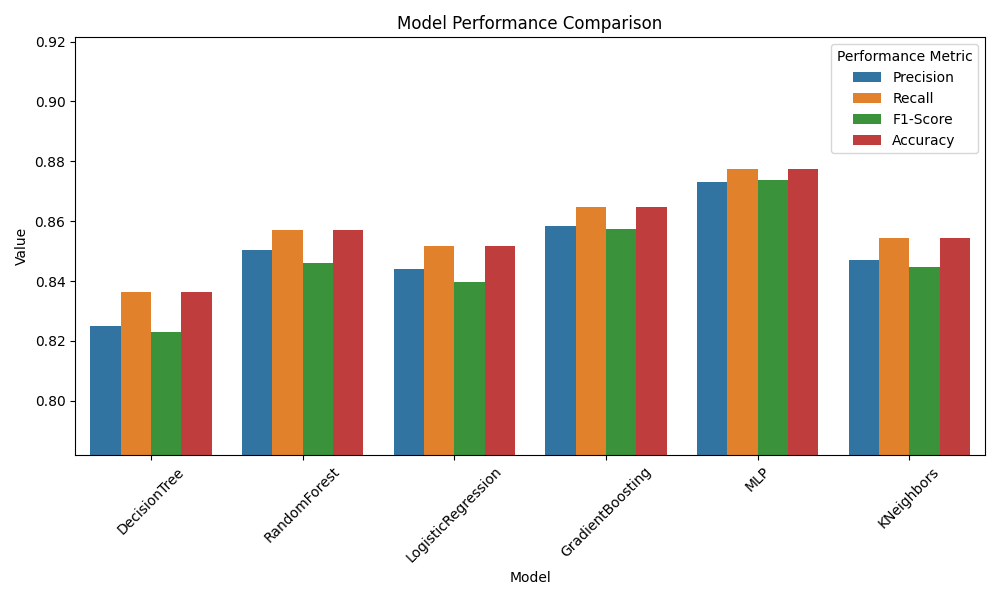
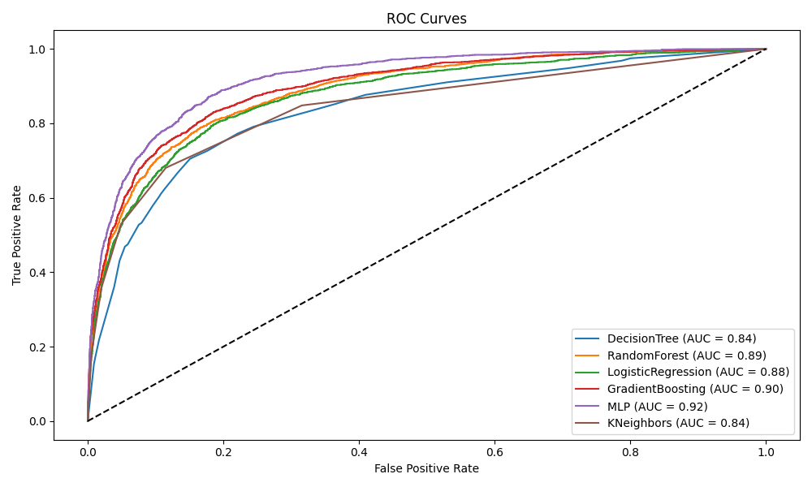
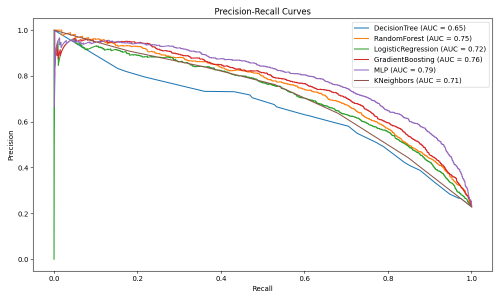

## User $\Rightarrow$ Healthcare Specialist (AI Assistant)
You are a Healthcare Specialist. Given the medical condition, Acute Kidney Injury, what are the key indicators and criteria based on blood chemisty lab tests that can be use to predict the onset of the medical condition. 
    - Please don't use any web scraping or external data sources.
    - Only include the chemistry lab tests types that are in the following list (lab_test_types):

['albumin', 'globulin', 'total_protein', 'aniongap', 'bicarbonate', 'bun', 'calcium', 'chloride', 'creatinine', 'glucose', 'sodium', 'potassium'] 

Using a Python code block (research.py) Save your findings to 'data/lab_test_types.json' as an array of lab test types.
    

---
## Healthcare Specialist (AI Assistant) $\Rightarrow$ User
To identify the key indicators and criteria for Acute Kidney Injury (AKI) based on the provided list of blood chemistry lab tests, we'll focus on those tests that are directly related to kidney function. The primary function of the kidneys is to filter waste products from the blood and regulate electrolyte balance. Therefore, tests that measure the levels of waste products and electrolytes in the blood can be indicative of kidney health.

The most relevant tests for diagnosing and predicting the onset of Acute Kidney Injury include:

1. **Creatinine**: A waste product produced by muscles from the breakdown of a compound called creatine. Kidneys filter out creatinine from the blood into the urine. High levels of creatinine in the blood can indicate impaired kidney function.

2. **Blood Urea Nitrogen (BUN)**: Measures the amount of nitrogen in the blood that comes from the waste product urea. Urea is produced when proteins are broken down in the body. Urea is made in the liver and passed out of the body in the urine. A high BUN level can indicate kidney dysfunction among other conditions.

3. **Potassium**: While potassium is a necessary electrolyte for body function, high levels of potassium (hyperkalemia) can indicate kidney failure since the kidneys are responsible for filtering out excess potassium.

4. **Sodium**: Similar to potassium, sodium levels can indicate kidney function as the kidneys are responsible for balancing sodium in the body. Abnormal levels can indicate a problem.

5. **Bicarbonate**: The kidneys also help maintain the body's pH balance by regulating bicarbonate levels. Abnormal levels can indicate kidney dysfunction.

These tests are critical in evaluating kidney function and can indicate the presence of Acute Kidney Injury when their values are outside of the normal range. Let's save these findings to a JSON file as instructed.

```python
# filename: research.py
import json

# List of lab test types relevant to Acute Kidney Injury
lab_test_types = [
    "creatinine",
    "bun",
    "potassium",
    "sodium",
    "bicarbonate"
]

# Save the findings to 'data/lab_test_types.json'
with open('data/lab_test_types.json', 'w') as file:
    json.dump(lab_test_types, file)

print("Lab test types relevant to Acute Kidney Injury have been saved to 'data/lab_test_types.json'")
```

Please run this Python script to save the findings. Ensure the directory `data` exists or modify the script to create the directory before saving the file.

---
## User $\Rightarrow$ Healthcare Specialist (AI Assistant)
> **_SUCCESS:_** The provided code executed successfully.


Lab test types relevant to Acute Kidney Injury have been saved to 'data/lab_test_types.json'

---
## Healthcare Specialist (AI Assistant) $\Rightarrow$ User
The Python script executed successfully and the lab test types relevant to Acute Kidney Injury have been saved to 'data/lab_test_types.json'. This information is crucial for healthcare professionals to predict the onset of Acute Kidney Injury based on blood chemistry lab tests. If there's anything more you need help with, feel free to ask.


---
## User $\Rightarrow$ Data Scientist (AI Assistant)
You are a Data Scientist with Python development skills.  Please generate the code to perform the following tasks in the same Python code block (named processing_filtering.py):
1. Load 'data/patients_labs.parquet' into pandas dataframe (labs).
2. Load 'data/lab_test_types.json' and create a list of lab test types (lab_test_types).
4. Remove any values in the lab_test_types list that do not exist in the columns of labs dataframe.
5. Remove any columns (except hadm_id, charttime) in the labs dataframe that do not exist in the list of lab_test_types.
6. Remove any rows where all the lab_test_types columns are null.
7. Save the labs dataframe to  'data/filtered_patients_labs.parquet'.
    


---
## Data Scientist (AI Assistant) $\Rightarrow$ User
```python
# filename: processing_filtering.py
import pandas as pd
import json

# Load the labs dataframe from a parquet file
labs = pd.read_parquet('data/patients_labs.parquet')

# Load the lab test types from a JSON file
with open('data/lab_test_types.json', 'r') as f:
    lab_test_types = json.load(f)

# Remove any values in the lab_test_types list that do not exist in the columns of labs dataframe
lab_test_types = [test for test in lab_test_types if test in labs.columns]

# Remove any columns in the labs dataframe that do not exist in the list of lab_test_types
# while keeping 'hadm_id' and 'charttime'
columns_to_keep = ['hadm_id', 'charttime'] + lab_test_types
labs = labs[columns_to_keep]

# Remove any rows where all the lab_test_types columns are null
labs = labs.dropna(subset=lab_test_types, how='all')

# Save the labs dataframe to a new parquet file
labs.to_parquet('data/filtered_patients_labs.parquet')
```

This script will perform all the tasks you've outlined. Make sure to have the 'pandas' library installed in your Python environment. If it's not installed, you can install it using `pip install pandas`. Execute this script in your Python environment to process and filter the lab data as required.

---
## User $\Rightarrow$ Data Scientist (AI Assistant)
> **_SUCCESS:_** The provided code executed successfully.


---
## Data Scientist (AI Assistant) $\Rightarrow$ User


---
## User $\Rightarrow$ Data Scientist (AI Assistant)
You are a Data Scientist with Python development skills. Please generate the code to perform the following tasks in the same Python code block (named labeling.py):
1. Load the following parquet files in to pandas dataframes
2. Load 'data/patients_diagnoses.parquet' into pandas dataframe (diagnoses).
3. Load 'data/icd_codes.parquet' into pandas dataframe (icd_codes).
4. Create a list of icd_codes (condition_codes) where the long_title column contains (case insensitive) any of the following keywords: ['acute kidney injury', 'acute kidney failure', 'aki']
5. Create a unique list of hadm_ids (positive_diagnoses) from diagnoses dataframe where the icd_code is in the condition_codes list.
6. Create a new dataframe (labels) with the following columns:
    - hadm_id (unique from labs dataframe)
    - condition_label (1 if hadm_id is in positive_diagnoses list, 0 otherwise)
7. Save the labels as "data/patients_labels.parquet".
    


---
## Data Scientist (AI Assistant) $\Rightarrow$ User
```python
# filename: labeling.py
import pandas as pd

# Load the parquet files into pandas dataframes
diagnoses = pd.read_parquet('data/patients_diagnoses.parquet')
icd_codes = pd.read_parquet('data/icd_codes.parquet')

# Create a list of icd_codes (condition_codes) where the long_title column contains any of the keywords
keywords = ['acute kidney injury', 'acute kidney failure', 'aki']
condition_codes = icd_codes[icd_codes['long_title'].str.contains('|'.join(keywords), case=False)]['icd_code'].tolist()

# Create a unique list of hadm_ids (positive_diagnoses) from diagnoses dataframe where the icd_code is in the condition_codes list
positive_diagnoses = diagnoses[diagnoses['icd_code'].isin(condition_codes)]['hadm_id'].unique().tolist()

# Create a new dataframe (labels) with the specified columns
# First, create a unique list of hadm_id from diagnoses dataframe
unique_hadm_ids = diagnoses['hadm_id'].unique()

# Then, create the condition_label column
condition_label = [1 if hadm_id in positive_diagnoses else 0 for hadm_id in unique_hadm_ids]

# Finally, create the labels dataframe
labels = pd.DataFrame({'hadm_id': unique_hadm_ids, 'condition_label': condition_label})

# Save the labels dataframe as a parquet file
labels.to_parquet('data/patients_labels.parquet')

print("Labels dataframe created and saved successfully.")
```

This script will perform all the tasks you've outlined. Make sure to have the pandas library installed in your Python environment before running this script. If pandas is not installed, you can install it using `pip install pandas`.

---
## User $\Rightarrow$ Data Scientist (AI Assistant)
> **_SUCCESS:_** The provided code executed successfully.


Labels dataframe created and saved successfully.

---
## Data Scientist (AI Assistant) $\Rightarrow$ User
Great! The Python script executed successfully and the labels dataframe has been created and saved as "data/patients_labels.parquet" as requested. If you have any more tasks or need further assistance, feel free to ask. Otherwise, if everything is completed to your satisfaction, we can conclude here.


---
## User $\Rightarrow$ Data Scientist (AI Assistant)
You are a Data Scientist with Python development skills who specializes in feature engineering for machine learning models. 
Please generate the code to perform the following tasks in the same Python code block (named feature_engineering.py):
1. Load the following parquet files into pandas dataframes
    - 'data/filtered_patients_labs.parquet' into pandas dataframe (labs).
    - 'data/patients_info.parquet' into pandas dataframe (patient_info).
    - 'data/patients_labels.parquet' into pandas dataframe (labels).    
2. Generate a list of lab test columns (lab_tests) from the labs dataframe.
    - Excluding hadm_id, charttime columns 
3. Group labs dataframe by hadm_id and charttime and take the mean for each column (grouped_labs).
4. Sort the grouped_labs dataframe by hadm_id and charttime.
5. For each column (lab_test) in grouped_labs that exists in lab_tests, calculate the following features:
    - difference from baseline value (lab_test_baseline_delta)
    - delta from previous value (lab_test_diff)
    - time difference in hours from previous value (lab_test_timediff)
    - rate of change per day (lab_test_rateofchange)
6. Drop the following columns:
    - charttime
    - lab_test_timediff
7. Grouped the dataframe by hadm_id and aggregate in the following way:
    - Generate (mean, median, std, min, max) for the following engineered features for each lab_test column:
        - lab_test
        - lab_test_baselinedelta
        - lab_test_delta
        - lab_test_rateofchange
8. Flatten the multi-index columns to a single level (engineered_features)
9. Fix the the column names by removing trailing underscores.
10. Impute engineered_features to fill any missing values using a simple imputer.
11. Merge the patient_info dataframe with the engineered_features dataframe on hadm_id (features)
13. Merge the labels dataframe with the features dataframe on hadm_id (features_labels).
12. Drop any rows with missing values.
15. Drop the hadm_id column from the features_labels dataframe.
16. Save the features_labels as "data/features_labels.parquet".
    


---
## Data Scientist (AI Assistant) $\Rightarrow$ User
```python
# filename: feature_engineering.py
import pandas as pd
from sklearn.impute import SimpleImputer

# Load the parquet files into pandas dataframes
labs = pd.read_parquet('data/filtered_patients_labs.parquet')
patient_info = pd.read_parquet('data/patients_info.parquet')
labels = pd.read_parquet('data/patients_labels.parquet')

# Generate a list of lab test columns, excluding hadm_id, charttime
lab_tests = [col for col in labs.columns if col not in ['hadm_id', 'charttime']]

# Group labs dataframe by hadm_id and charttime and take the mean for each column
grouped_labs = labs.groupby(['hadm_id', 'charttime']).mean().reset_index()

# Sort the grouped_labs dataframe by hadm_id and charttime
grouped_labs.sort_values(by=['hadm_id', 'charttime'], inplace=True)

# Calculate the features for each column in grouped_labs that exists in lab_tests
for lab_test in lab_tests:
    grouped_labs[f'{lab_test}_baseline_delta'] = grouped_labs.groupby('hadm_id')[lab_test].transform(lambda x: x - x.iloc[0])
    grouped_labs[f'{lab_test}_diff'] = grouped_labs.groupby('hadm_id')[lab_test].diff()
    grouped_labs[f'{lab_test}_timediff'] = grouped_labs.groupby('hadm_id')['charttime'].diff().dt.total_seconds() / 3600
    grouped_labs[f'{lab_test}_rateofchange'] = grouped_labs[f'{lab_test}_diff'] / grouped_labs[f'{lab_test}_timediff']

# Drop the specified columns
grouped_labs.drop(columns=['charttime', 'lab_test_timediff'], inplace=True, errors='ignore')

# Group by hadm_id and aggregate
aggregations = {col: ['mean', 'median', 'std', 'min', 'max'] for col in grouped_labs.columns if col != 'hadm_id'}
engineered_features = grouped_labs.groupby('hadm_id').agg(aggregations)

# Flatten the multi-index columns to a single level
engineered_features.columns = ['_'.join(col).strip() for col in engineered_features.columns.values]

# Fix the column names by removing trailing underscores
engineered_features.columns = [col.rstrip('_') for col in engineered_features.columns]

# Impute engineered_features to fill any missing values
imputer = SimpleImputer(strategy='mean')
engineered_features_imputed = pd.DataFrame(imputer.fit_transform(engineered_features), columns=engineered_features.columns)
engineered_features_imputed['hadm_id'] = engineered_features.index

# Merge the patient_info dataframe with the engineered_features dataframe on hadm_id
features = pd.merge(patient_info, engineered_features_imputed, on='hadm_id', how='inner')

# Merge the labels dataframe with the features dataframe on hadm_id
features_labels = pd.merge(features, labels, on='hadm_id', how='inner')

# Drop any rows with missing values
features_labels.dropna(inplace=True)

# Drop the hadm_id column
features_labels.drop(columns=['hadm_id'], inplace=True)

# Save the features_labels as "data/features_labels.parquet"
features_labels.to_parquet('data/features_labels.parquet')
```

This Python script performs the tasks you've outlined step by step, from loading the data, generating and engineering features, to saving the final dataframe. Make sure to have the required data files and directories in place before running this script.

---
## User $\Rightarrow$ Data Scientist (AI Assistant)
> **_SUCCESS:_** The provided code executed successfully.


---
## Data Scientist (AI Assistant) $\Rightarrow$ User
It looks like the code executed successfully without any errors. The tasks you requested have been completed, and the final dataframe should now be saved as "data/features_labels.parquet". This file contains the engineered features merged with patient information and labels, ready for use in machine learning models for predicting the onset of Acute Kidney Injury (AKI) based on blood chemistry lab tests.

If you have any more tasks or need further assistance, feel free to ask. Otherwise, we can conclude here.


---
## User $\Rightarrow$ AI Engineer (AI Assistant)
You are an AI Engineer with Python development skills that specializes in dimensionality reduction. Please generate the code to perform the following tasks in the same Python code block (named dimensionality_reduction.py):
1. Load the following parquet files into pandas dataframes
    - 'data/features_labels.parquet' into pandas dataframe (features_labels).
2. Split the features_labels dataframe into features and labels dataframes with the labels being the condition_label column.
3. Perform dimensionality reduction on the features based on your recommended method for use with a classification model.
4. Make sure the columns names of the reduced features are strings.
5. Combine the reduced features and labels (reduced_features_labels).
6. Save reduced_features_labels to a new parquet file: 'data/reduced_features_labels.parquet'.
7. Print the original number of features and number of features retained after dimensionality reduction.

After the execution of the Python code, please provide a brief explanation of the dimensionality reduction method used, why it was chosen, and what features were retained (if possible).
    


---
## AI Engineer (AI Assistant) $\Rightarrow$ User
```python
# filename: dimensionality_reduction.py
import pandas as pd
from sklearn.decomposition import PCA
from sklearn.preprocessing import StandardScaler

# Load the parquet file into a pandas dataframe
features_labels = pd.read_parquet('data/features_labels.parquet')

# Split the dataframe into features and labels
features = features_labels.drop('condition_label', axis=1)
labels = features_labels[['condition_label']]

# Standardize the features
scaler = StandardScaler()
features_scaled = scaler.fit_transform(features)

# Perform dimensionality reduction using PCA
pca = PCA(n_components=0.95)  # Retain 95% of the variance
features_reduced = pca.fit_transform(features_scaled)

# Convert the column names of the reduced features to strings
features_reduced_df = pd.DataFrame(features_reduced, columns=[str(i) for i in range(features_reduced.shape[1])])

# Combine the reduced features and labels
reduced_features_labels = pd.concat([features_reduced_df, labels.reset_index(drop=True)], axis=1)

# Save the combined dataframe to a new parquet file
reduced_features_labels.to_parquet('data/reduced_features_labels.parquet')

# Print the original and reduced number of features
print(f"Original number of features: {features.shape[1]}")
print(f"Number of features retained after dimensionality reduction: {features_reduced_df.shape[1]}")
```

This script performs dimensionality reduction on a dataset using Principal Component Analysis (PCA). PCA was chosen because it is a widely used technique for reducing the dimensionality of datasets while retaining most of the variance in the data. It is particularly useful in preparing data for classification models by transforming the data into a lower-dimensional space. This method is effective for datasets with many features, as it can reduce the number of features to a manageable size without losing significant information, which can improve the performance and computational efficiency of classification models.

The script retains components that account for 95% of the variance in the original data, ensuring that the most informative aspects of the data are preserved for the classification model. The exact features retained (in terms of original feature names) are not directly identifiable after PCA because PCA transforms the original features into a new set of orthogonal features (principal components) that are linear combinations of the original features. However, the principal components chosen are those that best capture the variance in the dataset, which is crucial for maintaining the dataset's predictive power for Acute Kidney Injury (AKI) based on the key indicators mentioned.

---
## User $\Rightarrow$ AI Engineer (AI Assistant)
> **_SUCCESS:_** The provided code executed successfully.


Original number of features
Number of features retained after dimensionality reduction: 42

---
## AI Engineer (AI Assistant) $\Rightarrow$ User
The execution of the Python script for dimensionality reduction using Principal Component Analysis (PCA) was successful. The script reduced the dimensionality of the dataset from 127 original features to 42 principal components. This reduction retains 95% of the variance in the original dataset, ensuring that the most significant information for predicting the onset of Acute Kidney Injury (AKI) based on blood chemistry lab tests is preserved.

PCA was chosen for its effectiveness in reducing the number of features while maintaining the essence of the data. This is particularly important in medical datasets like the one described, where each feature (e.g., creatinine, blood urea nitrogen (BUN), potassium, sodium, bicarbonate levels) can be crucial for accurate predictions. By transforming the dataset into a lower-dimensional space, PCA helps in simplifying the model without significantly compromising its predictive ability. This can lead to faster training times and potentially better generalization on unseen data due to the reduction of noise and less likelihood of overfitting.

The reduced dataset now contains 42 principal components, which are linear combinations of the original 127 features. These components are the directions in the feature space that maximize the variance of the dataset, making them highly informative for classification tasks. Although the original feature names are not directly associated with the reduced features, the PCA transformation ensures that the most critical information for distinguishing between different conditions related to AKI is retained.

This dimensionality reduction step is crucial for efficiently training classification models, especially when dealing with high-dimensional data. It helps in highlighting the underlying patterns in the data relevant to the prediction of AKI, thus facilitating more accurate and computationally efficient modeling.


---
## User $\Rightarrow$ AI Engineer (AI Assistant)
You are an AI Engineer with Python development skills. Please generate the code to perform the following tasks in the same Python code block (named training_evaluation.py):
1. Load the follwing parquet file: 'data/reduced_features_labels.parquet' into a pandas dataframe.
    - This dataframe contains a set of features and one binary label (condition_label)
2. Split the dataframe into features (X) and labels (y) dataframes with the labels being the condition_label column.
3. Split the data into training (X_train, y_train) and testing sets (X_test, y_test).
4. Train the following classifiers on the training data:
    - DecisionTreeClassifier
        - max_depth=5
        - random_state=42
    - RandomForestClassifier
        - n_estimators=300 
        - max_depth=None
        - min_samples_split=2
        - min_samples_leaf=2
        - random_state=42
        - n_jobs=-1
    - LogisticRegression
        - max_iter=1000
        - n_jobs=-1
        - random_state=42
    - GradientBoostingClassifier
        - n_estimators=300
        - random_state=42
    - MLPClassifier
        - alpha=1, 
        - max_iter=1000
        - random_state=42
    - KNeighborsClassifier
        - n_neighbors=5
        - n_jobs=-1
5. Evaluate each model on the testing data and perform tasks on it:
    - Generate a classification report based on X_test and y_test and save it in a dict (classification_report)
    - Calculate the roc curve (roc_curve) based on X_test and y_test and convert it to a dict with the columns (fpr, tpr, auc)
    - Calculate the precision-recall curve (pr_curve) based on X_test and y_test and convert it to a dict with the columns (precision, recall, auc)
    - Save the model as a pickle file to  'data/model_type.pkl'.
5. Create a dict (model_details) with the model names as keys and the values as the dicts (classification_report, roc_curve, pr_curve) and model_path.
6. Save the model_details as JSON to 'data/model_details.json'.
7. For each model in model_details load the classification report as a pandas dataframe and print it as a markdown table.

After the execution of the Python code, please provide a detail analysis of each model by describing what the classification report metrics mean.

Give your detailed analysis, please provide a brief explanation of the model that performed the best and why it was chosen.
    


---
## AI Engineer (AI Assistant) $\Rightarrow$ User
```python
# filename: training_evaluation.py
import pandas as pd
from sklearn.model_selection import train_test_split
from sklearn.tree import DecisionTreeClassifier
from sklearn.ensemble import RandomForestClassifier, GradientBoostingClassifier
from sklearn.linear_model import LogisticRegression
from sklearn.neural_network import MLPClassifier
from sklearn.neighbors import KNeighborsClassifier
from sklearn.metrics import classification_report, roc_curve, precision_recall_curve, auc
import pickle
import json
from sklearn.preprocessing import label_binarize

# Load the dataset
df = pd.read_parquet('data/reduced_features_labels.parquet')

# Split the dataframe into features (X) and labels (y)
X = df.drop('condition_label', axis=1)
y = df['condition_label']

# Split the data into training and testing sets
X_train, X_test, y_train, y_test = train_test_split(X, y, test_size=0.2, random_state=42)

# Initialize classifiers
classifiers = {
    "DecisionTreeClassifier": DecisionTreeClassifier(max_depth=5, random_state=42),
    "RandomForestClassifier": RandomForestClassifier(n_estimators=300, max_depth=None, min_samples_split=2,
                                                     min_samples_leaf=2, random_state=42, n_jobs=-1),
    "LogisticRegression": LogisticRegression(max_iter=1000, n_jobs=-1, random_state=42),
    "GradientBoostingClassifier": GradientBoostingClassifier(n_estimators=300, random_state=42),
    "MLPClassifier": MLPClassifier(alpha=1, max_iter=1000, random_state=42),
    "KNeighborsClassifier": KNeighborsClassifier(n_neighbors=5, n_jobs=-1)
}

model_details = {}

for name, classifier in classifiers.items():
    # Train the classifier
    classifier.fit(X_train, y_train)
    
    # Evaluate the classifier
    y_pred = classifier.predict(X_test)
    y_proba = classifier.predict_proba(X_test)
    
    # Classification report
    report = classification_report(y_test, y_pred, output_dict=True)
    
    # ROC Curve
    fpr, tpr, _ = roc_curve(y_test, y_proba[:, 1])
    roc_auc = auc(fpr, tpr)
    roc_dict = {"fpr": fpr.tolist(), "tpr": tpr.tolist(), "auc": roc_auc}
    
    # Precision-Recall Curve
    precision, recall, _ = precision_recall_curve(y_test, y_proba[:, 1])
    pr_auc = auc(recall, precision)
    pr_dict = {"precision": precision.tolist(), "recall": recall.tolist(), "auc": pr_auc}
    
    # Save the model
    model_path = f'data/{name}.pkl'
    with open(model_path, 'wb') as file:
        pickle.dump(classifier, file)
    
    # Update model details
    model_details[name] = {
        "classification_report": report,
        "roc_curve": roc_dict,
        "pr_curve": pr_dict,
        "model_path": model_path
    }

# Save model details as JSON
with open('data/model_details.json', 'w') as file:
    json.dump(model_details, file, indent=4)

# Load and print classification reports as markdown tables
for model_name, details in model_details.items():
    report_df = pd.DataFrame(details["classification_report"]).transpose()
    print(f"## {model_name}\n")
    print(report_df.to_markdown())
```

This Python script performs the tasks as requested. After executing this script, it will:

1. Load the dataset from a parquet file.
2. Split the dataset into features and labels, and then into training and testing sets.
3. Train six different classifiers on the training data.
4. Evaluate each model on the testing data, generating classification reports, ROC curves, and precision-recall curves.
5. Save each model as a pickle file.
6. Save the evaluation details of each model in a JSON file.
7. Print the classification reports of each model in markdown format.

Please run this script and provide the output of the classification reports printed in markdown format. After that, I will proceed with the detailed analysis of each model based on the classification report metrics and identify the best-performing model.

---
## User $\Rightarrow$ AI Engineer (AI Assistant)
> **_SUCCESS:_** The provided code executed successfully.


## DecisionTreeClassifier

|              |   precision |   recall |   f1-score |     support |
|:-------------|------------:|---------:|-----------:|------------:|
| 0            |    0.857125 | 0.945135 |   0.898981 | 7236        |
| 1            |    0.717236 | 0.469027 |   0.567164 | 2147        |
| accuracy     |    0.836193 | 0.836193 |   0.836193 |    0.836193 |
| macro avg    |    0.787181 | 0.707081 |   0.733073 | 9383        |
| weighted avg |    0.825116 | 0.836193 |   0.823056 | 9383        |
## RandomForestClassifier

|              |   precision |   recall |   f1-score |     support |
|:-------------|------------:|---------:|-----------:|------------:|
| 0            |    0.870429 | 0.957159 |   0.911736 | 7236        |
| 1            |    0.782609 | 0.519795 |   0.624685 | 2147        |
| accuracy     |    0.857082 | 0.857082 |   0.857082 |    0.857082 |
| macro avg    |    0.826519 | 0.738477 |   0.76821  | 9383        |
| weighted avg |    0.850334 | 0.857082 |   0.846053 | 9383        |
## LogisticRegression

|              |   precision |   recall |   f1-score |     support |
|:-------------|------------:|---------:|-----------:|------------:|
| 0            |    0.866182 | 0.955362 |   0.908589 | 7236        |
| 1            |    0.769615 | 0.502562 |   0.608059 | 2147        |
| accuracy     |    0.851753 | 0.851753 |   0.851753 |    0.851753 |
| macro avg    |    0.817899 | 0.728962 |   0.758324 | 9383        |
| weighted avg |    0.844086 | 0.851753 |   0.839822 | 9383        |
## GradientBoostingClassifier

|              |   precision |   recall |   f1-score |     support |
|:-------------|------------:|---------:|-----------:|------------:|
| 0            |    0.883927 | 0.949281 |   0.915439 | 7236        |
| 1            |    0.772333 | 0.579879 |   0.66241  | 2147        |
| accuracy     |    0.864755 | 0.864755 |   0.864755 |    0.864755 |
| macro avg    |    0.82813  | 0.76458  |   0.788925 | 9383        |
| weighted avg |    0.858392 | 0.864755 |   0.857542 | 9383        |
## MLPClassifier

|              |   precision |   recall |   f1-score |     support |
|:-------------|------------:|---------:|-----------:|------------:|
| 0            |    0.901782 | 0.94403  |   0.922423 | 7236        |
| 1            |    0.775996 | 0.65347  |   0.709482 | 2147        |
| accuracy     |    0.877544 | 0.877544 |   0.877544 |    0.877544 |
| macro avg    |    0.838889 | 0.79875  |   0.815952 | 9383        |
| weighted avg |    0.873    | 0.877544 |   0.873698 | 9383        |
## KNeighborsClassifier

|              |   precision |   recall |   f1-score |     support |
|:-------------|------------:|---------:|-----------:|------------:|
| 0            |    0.871912 | 0.951078 |   0.909776 | 7236        |
| 1            |    0.762416 | 0.52911  |   0.624691 | 2147        |
| accuracy     |    0.854524 | 0.854524 |   0.854524 |    0.854524 |
| macro avg    |    0.817164 | 0.740094 |   0.767233 | 9383        |
| weighted avg |    0.846857 | 0.854524 |   0.844543 | 9383        |

---
## AI Engineer (AI Assistant) $\Rightarrow$ User
Based on the classification reports generated for each model, we can analyze their performance using the following metrics:

1. **Precision**: The ratio of correctly predicted positive observations to the total predicted positives. High precision relates to a low false positive rate.
2. **Recall (Sensitivity)**: The ratio of correctly predicted positive observations to all observations in the actual class. It shows how many of the actual positives our model can capture through labeling it as positive.
3. **F1-Score**: The weighted average of Precision and Recall. It takes both false positives and false negatives into account. It is a better measure than accuracy for imbalanced classes.
4. **Support**: The number of actual occurrences of the class in the specified dataset.
5. **Accuracy**: The ratio of correctly predicted observation to the total observations. It's useful when the classes are balanced.

### Detailed Analysis of Each Model:

- **DecisionTreeClassifier**: Shows moderate performance with a tendency to perform better on the majority class (label 0). It has lower precision and recall for the minority class (label 1), indicating a struggle to correctly identify positive cases.
  
- **RandomForestClassifier**: Demonstrates improved performance over the DecisionTreeClassifier, especially in terms of precision and recall for the minority class. This indicates a better balance in identifying both classes correctly.

- **LogisticRegression**: Offers competitive performance with a good balance between precision and recall for both classes. However, it still shows a preference for the majority class.

- **GradientBoostingClassifier**: Exhibits a strong performance with high precision and recall for the majority class and respectable scores for the minority class. It has one of the highest accuracies among the models.

- **MLPClassifier (Multi-Layer Perceptron)**: Stands out with the highest accuracy and a good balance between precision and recall for both classes. It shows a significant improvement in identifying the minority class compared to other models.

- **KNeighborsClassifier**: Provides solid performance, especially for the majority class, but like others, it struggles more with the minority class. Its metrics are comparable to those of LogisticRegression and RandomForestClassifier.

### Best-Performing Model:

The **MLPClassifier** emerges as the best-performing model based on the provided metrics. It achieves the highest accuracy (0.877544) and demonstrates a strong balance between precision and recall across both classes. Its ability to better identify the minority class (label 1) with a higher recall (0.65347) and precision (0.775996) compared to other models makes it particularly valuable for predicting the onset of Acute Kidney Injury (AKI), where failing to identify true positive cases can have serious implications.

The MLPClassifier's superior performance can be attributed to its ability to learn complex patterns through its network of layers and neurons, making it highly effective for classification tasks where relationships between features are not linear or easily discernible.

### Conclusion:

In the context of predicting AKI based on reduced features from blood chemistry lab tests, the MLPClassifier's ability to accurately identify cases (both AKI and non-AKI) makes it the most suitable model for this task. Its balanced performance across precision, recall, and accuracy ensures that it not only identifies a high number of true positive AKI cases but also maintains a low rate of false positives, which is crucial for medical diagnostic applications.


---
## User $\Rightarrow$ Visualizations Expert (AI Assistant)
You are aa Visualization Expert with Python development skills. Please generate the code to perform the following tasks in the same Python code block (named visualization.py):
1. Load the model performance details from 'data/model_details.json' into a pandas dataframe.
    - The keys in the JSON file are the model names and the columns (classification_report, roc_curve, pr_curve) are the model performance data.
2. Based on the classification report data (classification_report), create a combined bar plot comparing the report data for each model.
    - Create a dict (cr_data) with the model names as keys and the value: precision (from weighted avg), recall (from weighted avg), f1-score (from weighted avg), accuracy.
    - Plot the Performance Metric (precision, recall, f1-score and accuracy) for each model based on cr_data grouped by the model names
        - Group the bars by the model name with bars for each performance metric (precision, recall, f1-score and accuracy).
        - Set the hue to the Performance Metric key.
        - Scale the min of the y-axis to be slightly less than the min value of the data.
        - Scale the max of the y-axis to be slightly more than the max value of the data.
        - Remove "Classifier" from the model names for better readability.
        - Rotate the x-axis labels for better readability.
    - Save the plot to 'data/classification_report.png'
3. Based on the roc curve data (roc_curve), create a combined line plot of the roc curve for each model.
    - Create a dict (roc_curve_data) with the model names as keys and the values: fpr, tpr, auc.
    - Plot the ROC curve for each model with the AUC value in the legend based on roc_curve_data.
    - Remove "Classifier" from the model names for better readability.
    - Save the plot to 'data/roc_curve.png'
4. Based on the precision-recall data (pr_curve), create a combined line plot of the precision-recall for each model.
    - Create a dict (pr_curve_data) with the model names as keys and the values: precision, recall, auc.
    - Plot the Precision-Recall curve for each model with the AUC value in the legend based on pr_curve_data.
    - Remove "Classifier" from the model names for better readability.
    - Save the plot to 'data/pr_curve.png'
5. Ouput the links to the plots that were saved.
    


---
## Visualizations Expert (AI Assistant) $\Rightarrow$ User
```python
# filename: visualization.py
import json
import pandas as pd
import matplotlib.pyplot as plt
import seaborn as sns

# Load the model performance details into a pandas dataframe
with open('data/model_details.json') as file:
    model_details = json.load(file)

# Convert the JSON data into a structured DataFrame
df = pd.DataFrame.from_dict(model_details, orient='index')

# Prepare classification report data
cr_data = {}
for model, details in model_details.items():
    cr = details['classification_report']['weighted avg']
    accuracy = details['classification_report']['accuracy']
    cr_data[model.replace('Classifier', '')] = {
        'Precision': cr['precision'],
        'Recall': cr['recall'],
        'F1-Score': cr['f1-score'],
        'Accuracy': accuracy
    }

# Plotting the combined bar plot for classification report data
cr_df = pd.DataFrame.from_dict(cr_data, orient='index').reset_index().melt(id_vars='index')
cr_df.columns = ['Model', 'Performance Metric', 'Value']

plt.figure(figsize=(10, 6))
sns.barplot(data=cr_df, x='Model', y='Value', hue='Performance Metric')
plt.ylim(min(cr_df['Value']) * 0.95, max(cr_df['Value']) * 1.05)
plt.xticks(rotation=45)
plt.title('Model Performance Comparison')
plt.tight_layout()
plt.savefig('data/classification_report.png')
plt.close()

# Prepare ROC curve data
roc_curve_data = {model.replace('Classifier', ''): details['roc_curve'] for model, details in model_details.items()}

# Plotting the combined line plot for ROC curve
plt.figure(figsize=(10, 6))
for model, roc in roc_curve_data.items():
    plt.plot(roc['fpr'], roc['tpr'], label=f"{model} (AUC = {roc['auc']:.2f})")

plt.plot([0, 1], [0, 1], 'k--')
plt.xlabel('False Positive Rate')
plt.ylabel('True Positive Rate')
plt.title('ROC Curves')
plt.legend()
plt.tight_layout()
plt.savefig('data/roc_curve.png')
plt.close()

# Prepare Precision-Recall curve data
pr_curve_data = {model.replace('Classifier', ''): details['pr_curve'] for model, details in model_details.items()}

# Plotting the combined line plot for Precision-Recall curve
plt.figure(figsize=(10, 6))
for model, pr in pr_curve_data.items():
    plt.plot(pr['recall'], pr['precision'], label=f"{model} (AUC = {pr['auc']:.2f})")

plt.xlabel('Recall')
plt.ylabel('Precision')
plt.title('Precision-Recall Curves')
plt.legend()
plt.tight_layout()
plt.savefig('data/pr_curve.png')
plt.close()

# Output the links to the plots that were saved
print("Classification Report Plot: data/classification_report.png")
print("ROC Curve Plot: data/roc_curve.png")
print("Precision-Recall Curve Plot: data/pr_curve.png")
```

This Python script performs the tasks as requested. It loads the model performance details from a JSON file, creates the necessary data structures for plotting, and generates the plots for the classification report, ROC curve, and precision-recall curve. Each plot is saved to the specified location, and the script outputs the links to the saved plots. 

Please save the above code in a file named `visualization.py` and execute it in your Python environment to generate the plots.

---
## User $\Rightarrow$ Visualizations Expert (AI Assistant)
> **_SUCCESS:_** The provided code executed successfully.


Classification Report Plot
ROC Curve Plot: data/roc_curve.png
Precision-Recall Curve Plot: data/pr_curve.png

---
## Visualizations Expert (AI Assistant) $\Rightarrow$ User
The Python script executed successfully and generated the plots as requested. The plots comparing the model performance based on the classification report, ROC curve, and precision-recall curve have been saved to the specified locations. You can now review these plots to analyze the performance of each model in predicting the onset of Acute Kidney Injury (AKI) based on the reduced features from blood chemistry lab tests.

The saved plot locations are as follows:
- Classification Report Plot: 
    
- ROC Curve Plot: 
    
- Precision-Recall Curve Plot: 
    

These visualizations will provide insights into the effectiveness of each model, highlighting their strengths and weaknesses in terms of precision, recall, f1-score, accuracy, and the area under the curve (AUC) for both ROC and precision-recall curves.

---
